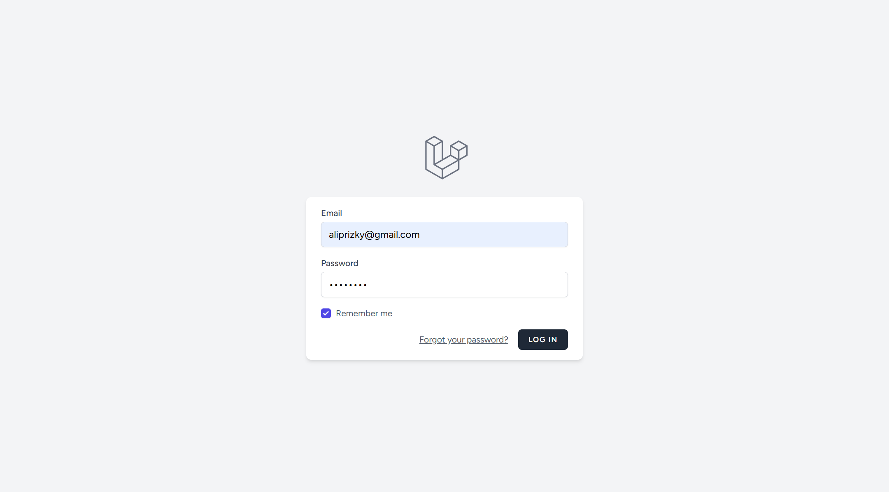
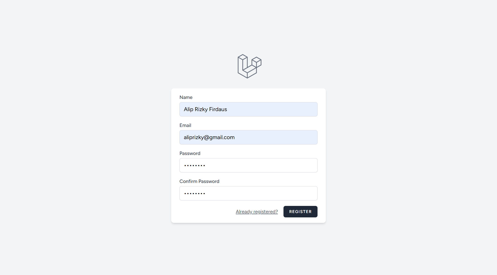
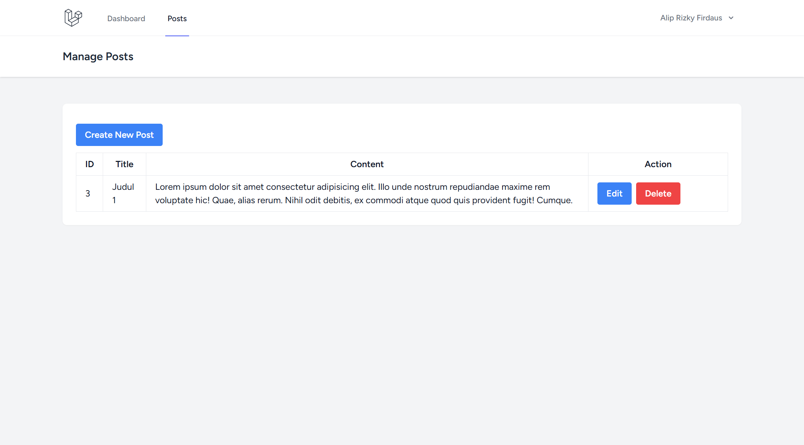
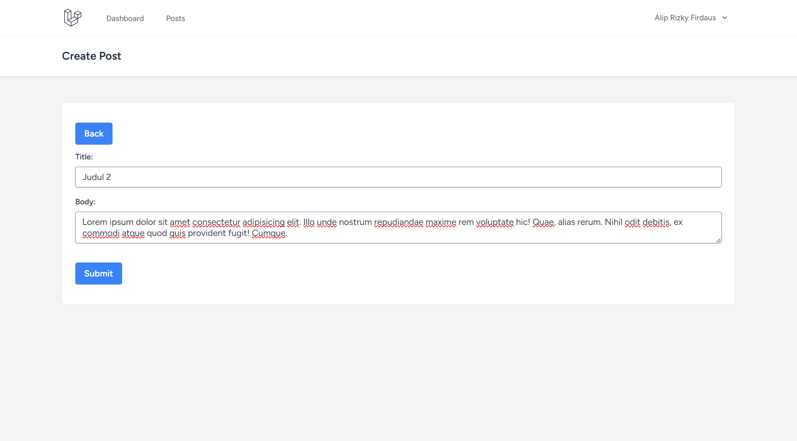
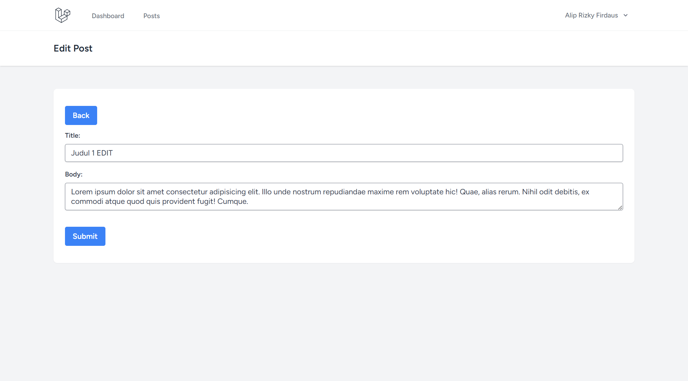
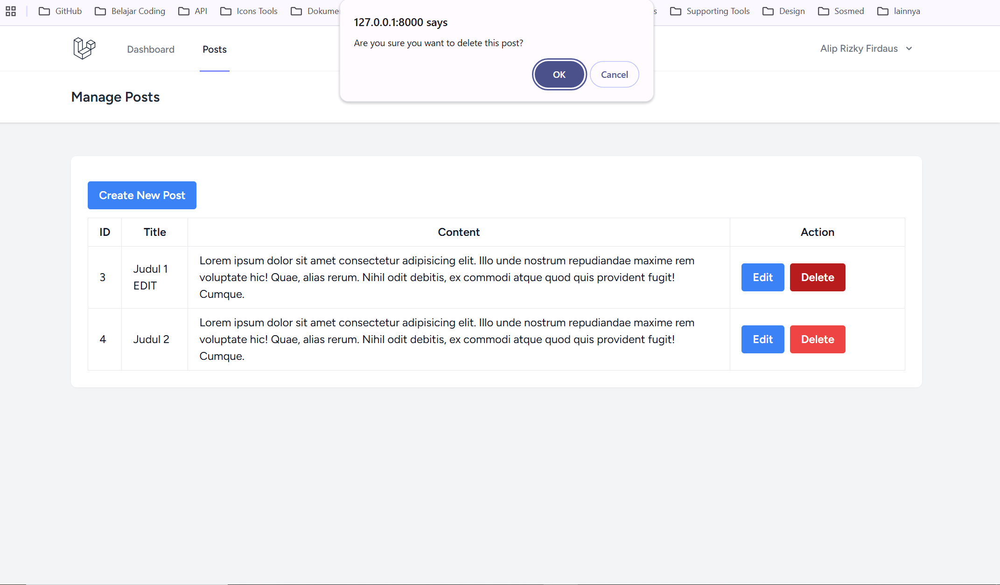

## Aplikasi CRUD dengan Register dan Login

Aplikasi ini adalah implementasi fitur CRUD (Create, Read, Update, Delete) dengan tambahan fitur autentikasi (register dan login) menggunakan Laravel 11, Vue JS, dan Inertia.js. Aplikasi ini memungkinkan pengguna untuk membuat, melihat, mengedit, dan menghapus postingan setelah melakukan autentikasi.

---

### Fitur Utama

1. **Autentikasi Pengguna**
    - Register dan Login menggunakan Laravel Breeze.
2. **CRUD Postingan**
    - Membuat, membaca, memperbarui, dan menghapus postingan.
3. **Frontend dengan Vue JS dan Inertia.js**
    - Pengalaman pengguna yang dinamis tanpa refresh halaman.

---

### Instalasi

Ikuti langkah-langkah berikut untuk menjalankan aplikasi ini secara lokal.

1. **Clone Repository**

    ```bash
    git clone https://github.com/username/nama-repo.git
    cd nama-repo
    ```

2. **Install Dependencies**

    ```bash
    composer install
    npm install
    ```

3. **Konfigurasi Environment**

    Salin file `.env.example` ke `.env` dan sesuaikan konfigurasi database.

    ```bash
    cp .env.example .env
    ```

    Edit file `.env` dan sesuaikan dengan pengaturan database Anda:

    ```bash
    DB_CONNECTION=mysql
    DB_HOST=127.0.0.1
    DB_PORT=3306
    DB_DATABASE=laravel
    DB_USERNAME=root
    DB_PASSWORD=
    ```

4. **Generate Key**

    ```bash
    php artisan key:generate
    ```

5. **Jalankan Migrasi Database**

    ```bash
    php artisan migrate
    ```

6. **Jalankan Aplikasi**

    ```bash
    php artisan serve
    ```

7. **Build Frontend**

    ```bash
    npm run build
    ```

Akses aplikasi di `http://localhost:8000`.

---

### Screenshot Aplikasi

**Halaman Login:**  


**Halaman Register:**  


**Halaman Daftar Postingan:**  


**Form Tambah Postingan:**  


**Proses Ubah & Hapus Postingan:**  



---

### Struktur Folder

```
project/
├── app/
│   ├── Http/
│   │   └── Controllers/
│   │       └── PostController.php
│   └── Models/
│       └── Post.php
├── database/
│   └── migrations/
│       └── create_posts_table.php
├── resources/
│   └── js/
│       └── Pages/
│           └── Post/
│               ├── Index.vue
│               ├── Create.vue
│               └── Edit.vue
├── routes/
│   └── web.php
└── .env
```

---

### Tips dan Saran

1. **Dark Mode**: Aktifkan dark mode di Laravel Breeze untuk tampilan yang lebih modern.
2. **Validasi**: Tambahkan validasi input pada form untuk memastikan data yang dikirim sesuai.
3. **Upload Gambar**: Tambahkan fitur upload gambar untuk memperkaya postingan.

Selamat mencoba dan semoga sukses menjadi **Full-Stack Developer**! 🚀

---

### Lisensi

MIT License.
